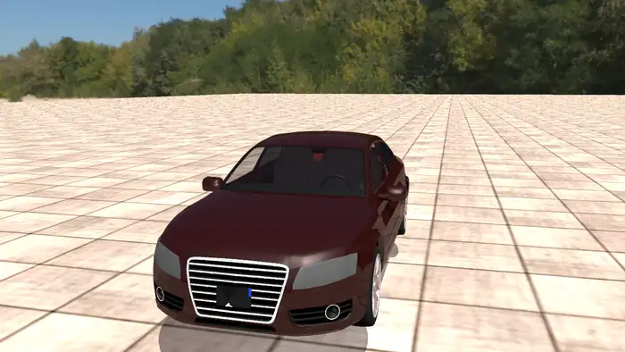
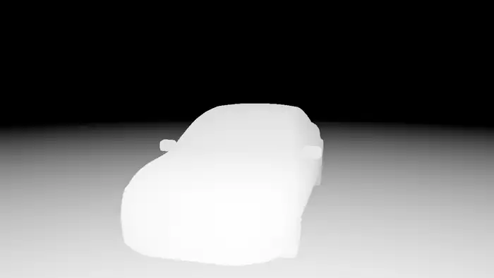
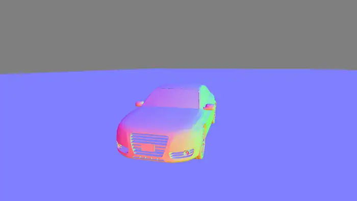
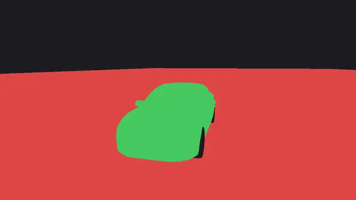
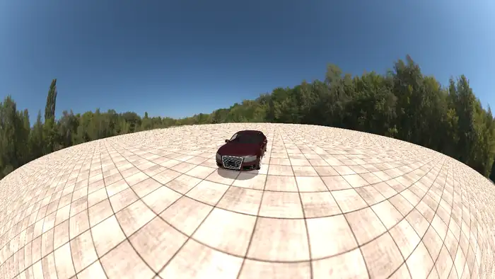
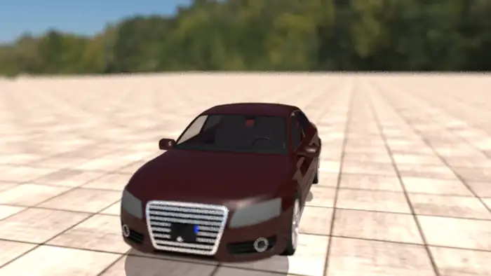
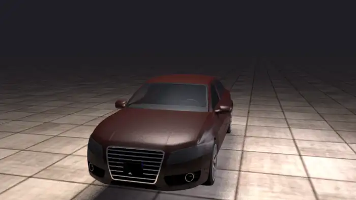
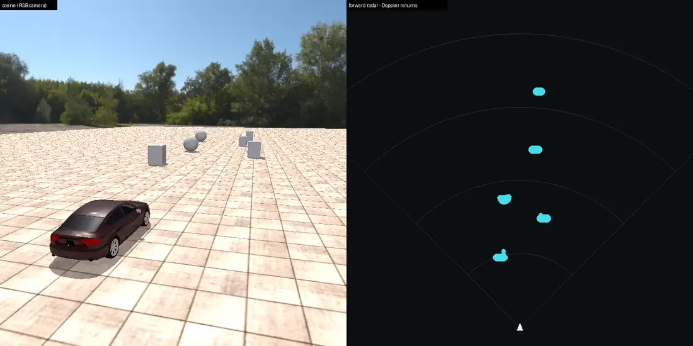

# Chrono::Sensor — Metal (Apple GPU) Ray-Tracing Backend — Feature Showcase

Native, hardware-ray-traced camera / lidar / radar sensor simulation for **PyChrono & Chrono::Sensor on Apple Silicon**, rendered entirely on the GPU through Metal — no CUDA, no OptiX. The backend mirrors Chrono's OptiX shading model (Cook-Torrance PBR, HDR environment lighting, GI, physical-camera effects) so sensor output matches the reference across platforms.

Every animation below is rendered live by the Metal backend on an Apple GPU and captured headlessly (`ChFilterSave` → animated WebP). All demos use only assets that ship with Chrono, so they are fully reproducible.

Each animation links to the **single self-contained simulation** that produced it — build it with [`demos/build.sh`](demos/build.sh), run it, and it writes exactly the frames shown. The frames→WebP step and full instructions live in [`tools/`](tools/README.md). All parked-car demos share one canonical camera orbit, so their animations are frame-synchronized with each other.

---

## 📷 Camera modes

The camera sensor renders four synchronized output types from the same ray-traced scene.

| RGB | Depth |
|:---:|:---:|
|  [▶ showcase_camera_rgb.cpp](demos/showcase_camera_rgb.cpp) |  [▶ showcase_camera_depth.cpp](demos/showcase_camera_depth.cpp) |
| Photorealistic hardware ray tracing — glossy PBR paint, HDR sky, soft shadows. | Per-pixel range as a grayscale depth map (0–20 m). |

| Surface normals | Segmentation |
|:---:|:---:|
|  [▶ showcase_camera_normal.cpp](demos/showcase_camera_normal.cpp) |  [▶ showcase_camera_segmentation.cpp](demos/showcase_camera_segmentation.cpp) |
| World-space surface normals encoded as RGB — reveals fine body-panel curvature. | Semantic + instance labels rendered directly by the ray tracer. |

---

## 🔭 Lenses & physical camera

Realistic optics and sensor imperfections, all computed in the ray generator / post chain.

| Fisheye (equidistant) | Radial (barrel) distortion |
|:---:|:---:|
|  [▶ showcase_lens_fisheye.cpp](demos/showcase_lens_fisheye.cpp) |  [▶ showcase_lens_radial.cpp](demos/showcase_lens_radial.cpp) |
| Wide-angle FOV lens (~143°) — the horizon bends around the frame. | Action-cam barrel distortion via radial coefficients (k₁,k₂,k₃). |

| Depth of field | Sensor grain & vignette |
|:---:|:---:|
|  [▶ showcase_physcam_dof.cpp](demos/showcase_physcam_dof.cpp) |  [▶ showcase_physcam_grain.cpp](demos/showcase_physcam_grain.cpp) |
| Thin-lens bokeh — the whole car stays sharp while the terrain and trees melt into background blur. | Under-exposed low-light look: vignette + Gaussian sensor noise. |

---

## 💡 Lighting & materials

Physically based lighting: path-traced global illumination, HDR image-based lighting, soft area-light shadows, fog, and analytic lights.

| Global illumination | Area-light soft shadows |
|:---:|:---:|
|  [▶ showcase_gi.cpp](demos/showcase_gi.cpp) |  [▶ showcase_arealights.cpp](demos/showcase_arealights.cpp) |
| Path-traced indirect bounce light fills the shadows (vs. flat ambient). | Disk + rectangle area lights cast true penumbra-edged soft shadows. |

| HDR environment reflections | Fog |
|:---:|:---:|
|  [▶ showcase_envmap.cpp](demos/showcase_envmap.cpp) |  [▶ showcase_fog.cpp](demos/showcase_fog.cpp) |
| An HDR environment map is mirrored in the glossy paint and glass. | Exponential scattering fog fades the scene into distance haze. |

| Night — headlights switch on | |
|:---:|:---:|
|  [▶ showcase_night_headlights.cpp](demos/showcase_night_headlights.cpp) | |
| Static rear view of a parked Audi in a near-black night: it sits dark, then the headlights switch on and two spot-light beams sweep the road ahead. | |

---

## 📡 Range sensors

Lidar and radar trace the **same accelerated BVH** as the cameras and return true range data. Here their raw returns are decoded into the representations engineers actually use.

| 360° lidar — bird's-eye point cloud | Forward radar — Doppler returns |
|:---:|:---:|
|  [▶ showcase_lidar.cpp](demos/showcase_lidar.cpp) |  [▶ showcase_radar.cpp](demos/showcase_radar.cpp) |
| A roof lidar sweeps a full circle as the car drives; returns are shown as a car-centric BEV point cloud, colored by height, with the obstacle lane and side walls clearly resolved. | A front radar's returns, placed in its forward FOV wedge and colored by Doppler closing speed — brighter/redder as the car drives toward the obstacle field. |

## 🛰️ Multi-sensor rig

Multiple sensors run **simultaneously** off one moving vehicle, sharing a single accelerated ray-traced scene.

| Four sensors at once (driving) |
|:---:|
|  [▶ showcase_multisensor.cpp](demos/showcase_multisensor.cpp) |
| An Audi drives past semantically-labelled obstacles while an **RGB camera, depth camera, surface-normal camera, and segmentation camera** all sample the identical chase view every frame — shown here as a live 2×2 panel. |

---

*Rendered on Apple Silicon via the Chrono::Sensor Metal RT backend. Simulation sources: [`demos/`](demos/) · post-processing & repro steps: [`tools/`](tools/README.md).*
